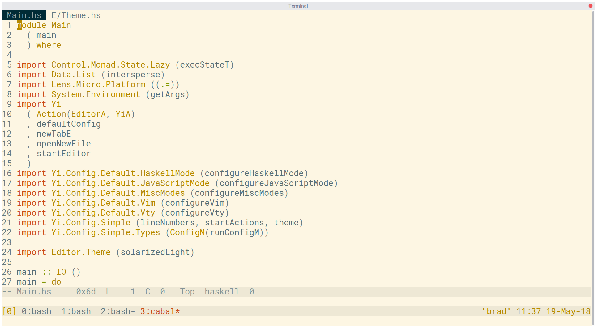
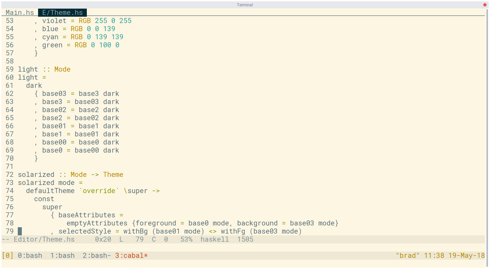

# Customised Yi Editor

My customized [Yi](https://yi-editor.github.io/).

If you're using solarized light in your terminal it should look like this:





**Note**

If you're not using solarized it'll look weird, I'm doing a trick to borrow colors as configured by the terminal.

## Todo

* Include Hindent as a library and call before save
* Include a bunch more language modes

## Development

### System requirements

* Nix

Once you've got Nix run: `nix-shell` to get you a shell with everything you need.

### Running

```
$ cabal run src/Main.hs src/Editor/Theme.hs
```

### Building

```
$ cabal build
```
